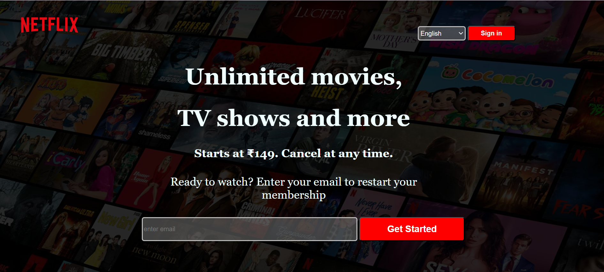

# 🎬 Netflix Clone 

A visually captivating **Netflix-inspired landing page** built using **HTML and CSS**, closely resembling the official Netflix India homepage. This project focuses on layout replication, and aesthetic accuracy.

---

## 📸 Preview



---

## 🌟 Features

- 🎨 Accurate UI clone of Netflix's homepage
- 🌐 Language selection dropdown
- 🔐 Sign-in button with hover effects
- 📧 Email input and CTA button
- 🖼️ Background overlay for readability

---

## 🛠️ Tech Stack

- **HTML5**
- **CSS3**

---

## 💡 Learnings

Through this project, I strengthened my understanding of:

- Flexbox layout system
- Layering content over background images
- Styling form elements and buttons
- Font and color matching from real-world websites

---

## 🚀 How to Run Locally

   ```bash

1. Clone the repo:
   git clone https://github.com/vinaya2007/Netflix-Clone.git


2. Navigate to the project folder:
   cd Netflix-Clone

3. Open `index.html` in your browser.
```

## 📬 Contact
📧 vinayavinodh07@gmail.com
📞 +91 90032 80933

## Credits

Built by Vinaya V

